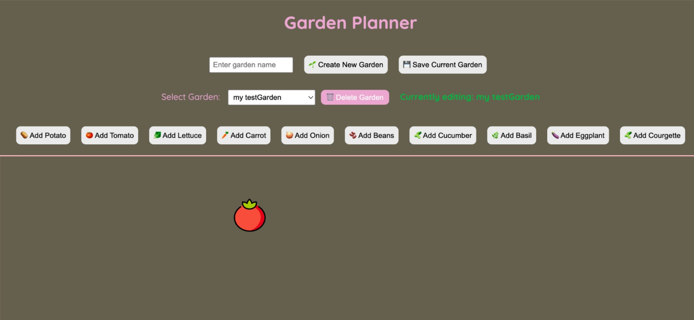
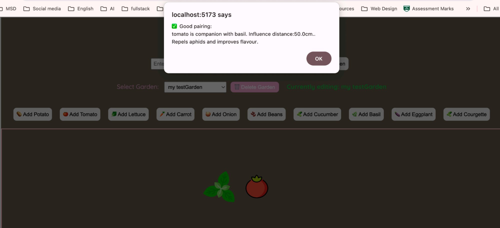
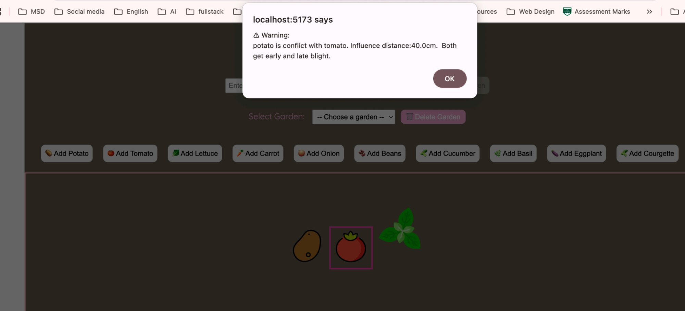
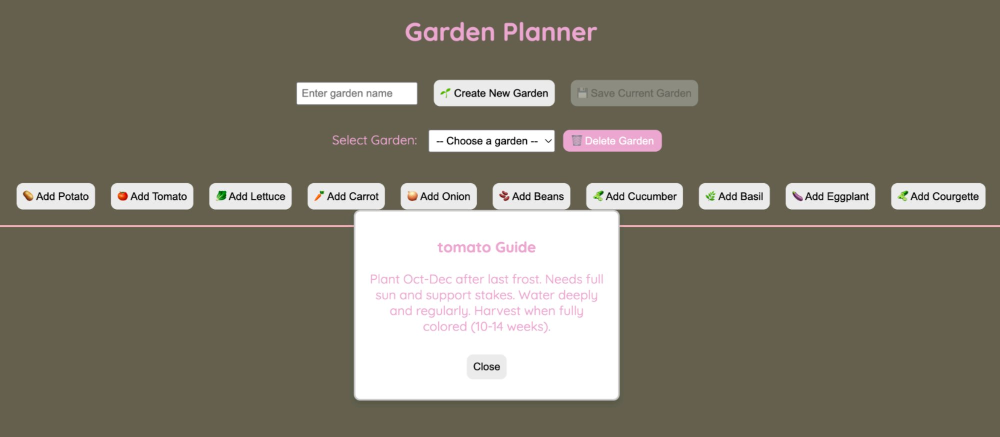
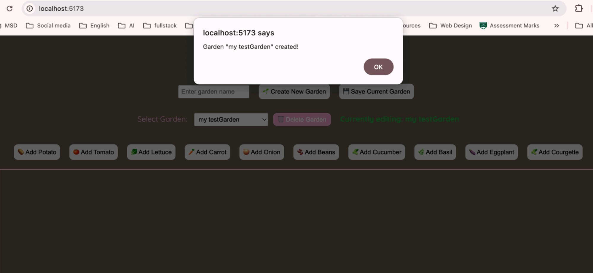
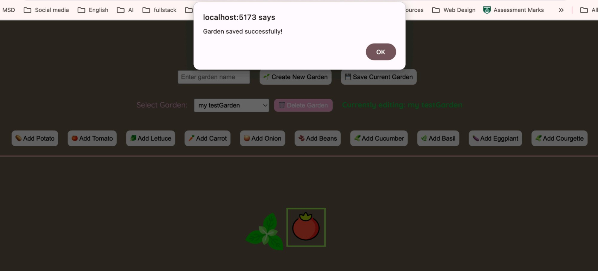

# 🌿 Garden Planner

A full-stack web application that helps New Zealand home gardeners design vegetable gardens using **companion planting** principles. Users visually arrange plants on a drag-and-drop canvas and receive real-time feedback about beneficial and harmful plant combinations.


## Demo

### Main Interface
Drag-and-drop canvas with 10 NZ vegetables, garden management controls, and real-time companion planting feedback.



### Companion Planting — Good Pairing ✅
Drag basil near tomato → the app detects a beneficial relationship, shows a green border and helpful message.



### Companion Planting — Conflict Warning ⚠️
Drag potato near tomato → the app warns about a harmful combination with a pink border.



### NZ Planting Guide
Double-click any plant to view a local growing guide with planting season, care tips, and harvest time.



### Garden Management
Create, save, load, and delete multiple garden plans with persistent storage.

<p>
  
  
</p>

## Features

- **Drag-and-Drop Garden Canvas** — Powered by React Konva, visually place and rearrange plants on an interactive canvas with boundary detection
- **Real-Time Companion Planting Analysis** — Automatically checks plant relationships using distance calculation algorithms; displays green borders for beneficial pairs and pink borders for conflicts
- **10 NZ Vegetables** — Potato, Tomato, Lettuce, Carrot, Onion, Beans, Cucumber, Basil, Eggplant, and Courgette with companion planting rules
- **Multi-Garden Management** — Create, save, load, switch between, and delete multiple garden plans
- **NZ-Specific Planting Guides** — Double-click any plant to view local growing information
- **Persistent Storage** — All garden layouts and plant positions are saved to PostgreSQL and restored on load
- **Plant Interactions** — Right-click to delete plants, double-click for planting guides

## Architecture

```
Browser (localhost:5173)
     ↓ HTTP / JSON
React + Vite Frontend
├── KonvaCanvas      — drag-and-drop canvas, visual feedback
├── ItemImage        — individual plant components
└── State            — plants, gardens, highlights, guides
     ↓ fetch() API calls
FastAPI Backend (localhost:8000)
├── /check-companion — distance calculation & rule checking
├── /gardens         — CRUD operations
└── Companion rules  — good/bad pair lists, distance thresholds
     ↓ SQL queries
PostgreSQL Database
├── gardens          — id, name, timestamps
└── plants           — id, garden_id, type, x, y, dimensions
```

## Tech Stack

| Layer | Technology | Why |
|-------|-----------|-----|
| **Frontend** | React, Vite, React Konva | Component-based UI with interactive canvas; Vite for fast HMR |
| **Backend** | Python, FastAPI, Pydantic | Auto-generated API docs at `/docs`, built-in request validation |
| **Database** | PostgreSQL, psycopg2 | Relational model fits structured garden/plant data; industry standard |
| **Communication** | REST API, fetch, JSON | Clean frontend-backend separation via HTTP |

## Getting Started

### Prerequisites

- **Node.js** (v18+) and npm
- **Python** (3.10+) and pip
- **PostgreSQL**

### 1. Clone the repository

```bash
git clone https://github.com/mussesseiniris/mygarden-planner.git
cd mygarden-planner
```

### 2. Database setup

```bash
# Install and start PostgreSQL (macOS)
brew install postgresql
brew services start postgresql

# Create database and tables
psql postgres
```

```sql
CREATE DATABASE garden_planner;
\c garden_planner

CREATE TABLE gardens (
    id SERIAL PRIMARY KEY,
    name VARCHAR(100) NOT NULL,
    created_at TIMESTAMP DEFAULT CURRENT_TIMESTAMP,
    updated_at TIMESTAMP DEFAULT CURRENT_TIMESTAMP
);

CREATE TABLE plants (
    id SERIAL PRIMARY KEY,
    garden_id INTEGER REFERENCES gardens(id) ON DELETE CASCADE,
    plant_id BIGINT NOT NULL,
    plant_type VARCHAR(50) NOT NULL,
    x INTEGER NOT NULL,
    y INTEGER NOT NULL,
    width INTEGER NOT NULL,
    height INTEGER NOT NULL
);

CREATE INDEX idx_plants_garden_id ON plants(garden_id);
```

### 3. Start the backend

```bash
cd my-garden-fastApi
pip install fastapi uvicorn psycopg2-binary
uvicorn main:app --reload
```

Backend runs at `http://localhost:8000`
Interactive API docs at `http://localhost:8000/docs`

### 4. Start the frontend

```bash
cd my-garden-vite
npm install
npm run dev
```

Frontend runs at `http://localhost:5173`

## Usage

| Step | Action | Result |
|------|--------|--------|
| 1 | Enter a garden name and click **Create New Garden** | New garden is created with confirmation |
| 2 | Click any **Add [Vegetable]** button | Plant appears on the canvas |
| 3 | **Drag** plants around the canvas | Positions update with boundary detection |
| 4 | Drag plants **near each other** | Companion planting check triggers automatically |
| 5 | **Double-click** a plant | NZ-specific planting guide popup appears |
| 6 | **Right-click** a plant | Plant is removed from the canvas |
| 7 | Click **Save Current Garden** | Layout is persisted to PostgreSQL |
| 8 | Use **Select Garden** dropdown | Switch between saved garden plans |

## Companion Planting Example

| Action | Result |
|--------|--------|
| Drag **Basil** near **Tomato** | ✅ Good pairing — green border. Repels aphids and improves flavour |
| Drag **Potato** near **Tomato** | ⚠️ Warning — pink border. Both get early and late blight |
| Plants placed far apart | No feedback (outside interaction distance) |

## Background & Motivation

As a landscape designer who spent over a decade working on large-scale municipal, residential, and commercial projects, I saw how often beginner home gardeners struggled with basic planting decisions — especially which vegetables grow well together. Companion planting knowledge is well-documented but rarely presented in an interactive, visual way. This project brings that expertise into a tool that makes garden design approachable and educational for New Zealand growers.

## Author

**Iris** — Master of Software Development candidate at Victoria University of Wellington (graduating July 2026). Combining a background in landscape architecture with a passion for building practical, user-centred software.

- GitHub: [@mussesseiniris](https://github.com/mussesseiniris)
<!-- - LinkedIn: [your-linkedin-url] -->
<!-- - Portfolio: [your-portfolio-url] -->


